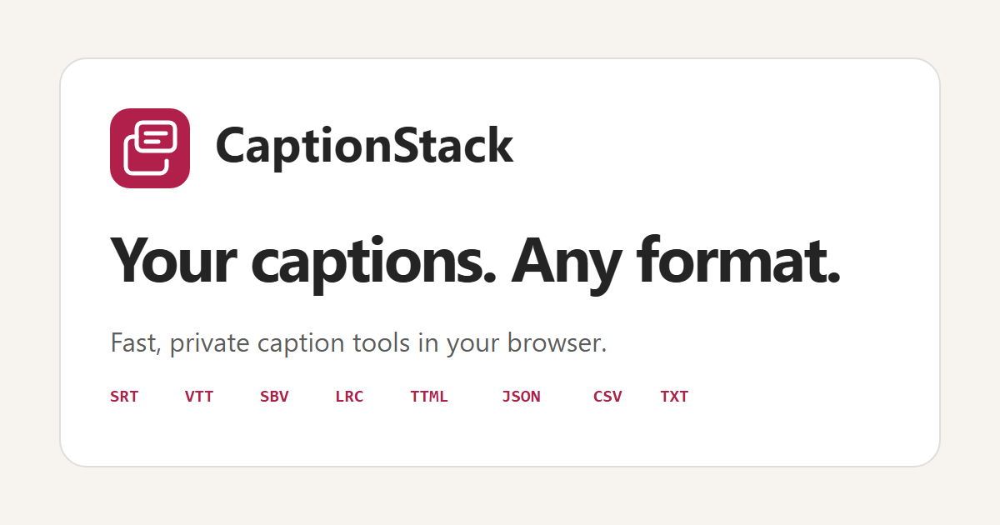

# CaptionStack

<p align="center">
  <a href="https://captionstack.app/">
    
  </a>
</p>

A growing collection of private, browser-based caption tools. CaptionStack currently reads, previews, edits, and converts caption files without uploading them to a server.

**Live site:** [captionstack.app](https://captionstack.app/)

## Supported formats

| Format | Import | Export |
| --- | :---: | :---: |
| SubRip (`.srt`) | Yes | Yes |
| WebVTT (`.vtt`) | Yes | Yes |
| YouTube SBV (`.sbv`) | Yes | Yes |
| LRC (`.lrc`) | Yes | Yes |
| TTML (`.ttml`, `.xml`) | Yes | Yes |
| JSON (`.json`) | Yes | Yes |
| CSV (`.csv`) | Yes | Yes |
| Plain text (`.txt`) | Yes | Yes |

Plain-text imports receive three-second cue timings. Plain-text exports intentionally omit timing.

## Pasting captions

No file? Click **Paste caption text** under the drop zone, or press **Ctrl/⌘+V** anywhere on an empty converter. The format is detected from the content (an SRT block, a WebVTT snippet, a YouTube transcript, JSON from an API…), and files on the clipboard are accepted too. Pasted captions default to the file name `pasted-captions`.

## Transcripts with speakers

Podcast and meeting transcript exports are recognised inside `.txt` (and pasted text) when most entries carry a timestamp:

- **Blocks** — `00:14.08` / `Frank` / `text…` (speaker line optional), as produced by many podcast hosts.
- **Inline** — `[00:00:04] Bob: text`, `00:04 Bob: text`, or `Bob (00:04): text`, with continuation lines.

Each entry becomes a cue with its real start time (end = next start, or +3 s), and the speaker is kept as a `Name:` prefix. A banner above the editor lists the detected speakers and offers **Use dashes** (a leading `-` only when the speaker changes) or **Remove names**; both are Undo-able.

## The workspace

Once a file is loaded the page switches to a two-pane workspace on the same URL (so landing pages keep working and nothing needs to reload):

- **Toolbar** — file name, detected format, size, cue count and runtime; **Convert to** format picker; **Undo**; **Copy**; file name and **Download**.
- **Cues (left)** — the editor with inline quality warnings, plus **Timing** and **Find & replace** tools and the quality report.
- **Output (right, sticky)** — the converted file, split into one block per cue with light syntax highlighting. It follows the editor's page (50 cues at a time with "… N more cues …" markers), highlights the cue you're editing, and clicking a block jumps the editor to that cue. A **Media preview** tab puts the video/audio player in the same pane.

Under 960px the panes stack with a **Cues / Output** switch; jumping to a cue from the output switches back to the editor.

## Output, clipboard, and preferences

**Copy** puts the latest output on the clipboard, falling back to a legacy copy path where the Clipboard API is unavailable. The theme toggle and the last chosen output format are remembered in `localStorage` (`captionstack:theme`, `captionstack:output-format`); the saved theme is applied before first paint, and conversion landing pages always preselect their own target format.

## Batch conversion

Drop or pick several files at once to convert them together. Each file's format is detected independently, per-file errors (unsupported type, over 10 MB, malformed content) are shown inline without affecting the others, and the successful conversions download as a single ZIP archive (`captionstack-<count>-files-<format>.zip`). The archive is built in the browser with a dependency-free ZIP writer (`src/converter/zip.ts`).

## Editing cues

The editor is always open in the workspace's left pane:

- Edit each cue's start time, end time, and text inline.
- Add, delete, split, merge, and reorder cues.
- Invalid time ranges block export until fixed; overlapping cues are flagged as warnings but can still be exported.
- The preview and downloaded file always reflect your edits, and everything stays in your browser.

## Quality checks

Every imported or edited cue list is analyzed before export. The report above the editor summarizes errors, warnings, and passed checks, and each finding links to its cue:

| Check | Severity | One-click fix |
| --- | --- | --- |
| Valid time ranges | Error (blocks export) | — |
| No overlapping cues | Warning | Trim the previous cue's end to this cue's start; if that would make it too short, move this cue after it while preserving duration when the timeline has room |
| No empty cues | Warning | Remove the cue |
| Clean whitespace | Warning | Trim edges, collapse spaces, drop blank lines |
| Minimum duration (≥ 700 ms) | Warning | Extend to 1 s when possible, borrow safe display time from adjacent cues, or merge an immediately following cue from the same speaker when the text still fits |
| Line length (≤ 42 chars) | Warning | Re-wrap into balanced lines; if it still won't fit, split the cue into as many cues as needed (timing shared by text length, never below 700 ms each) |
| Line count (≤ 2 lines) | Warning | Same re-wrap / split as line length |
| Reading speed (≤ 20 chars/s) | Warning | Extend the end or borrow safe display time from adjacent cues |

Fixes are only offered when the result is unambiguous. **Fix all** can also redistribute spare time across a contiguous run when the run is long enough to satisfy every cue without overlap; **Undo** reverts any fix or structural edit.

## Timing tools

The **Timing** panel in the edit step retimes the whole cue list in one reversible step:

- **Shift** every cue by a signed offset (`1.5`, `-250ms`, `00:00:02.000`); times are clamped at zero.
- **Frame rate** retiming for captions authored against one frame rate and played at another (23.976 → 25 fps and friends), or any custom pair.
- **Two-point sync** — pick the cue that should start at time A and the cue that should start at time B; every other cue is moved and stretched to match, fixing offset and drift together.

A preview shows the first and last cue before and after; **Apply** records the change in the Undo history.

## Preview with media

**Preview with media** in the edit step lets you open a local video or audio file (never uploaded) and watch the captions play over it. Captions are delivered through a native `<track>` built from the current cues as WebVTT, so edits, fixes, and timing changes show up live. The panel shows which cue is on screen with a link into the editor, and each cue in the editor gains **▶ play from here**, **⇤ set start to playhead**, and **⇥ set end to playhead** — all recorded in the Undo history.

## Find and replace

**Find & replace** in the edit step searches every cue as you type, with *Match case*, *Whole word* (Unicode-aware), and *Regular expression* options. Matches are listed per cue with a highlighted snippet and a link that opens the editor at that cue. **Replace all** applies in one reversible step (Undo in the quality report); an empty replacement deletes matches, and in regex mode the replacement supports `$1`, `$<name>`, and `$&`.

## Performance

Parsing, quality analysis, and serialization run in a Web Worker (`src/converter/worker.ts`), so dropping a 10 MB file or editing a long cue list never freezes the page. The editor renders 50 cues per page, and the quality report lists findings in batches of 100. Browsers without module-worker support (and the test/prerender environments) fall back to the same code on the main thread.

## Local development

```bash
npm install
npm run dev
```

Use `npm test`, `npm run lint`, and `npm run build` to validate changes.

## Deploy to GitHub Pages

1. Push the project to a GitHub repository with `main` as its default branch.
2. Open **Settings → Pages** in the repository.
3. Set **Source** to **GitHub Actions**.
4. Push to `main` or run **Deploy CaptionStack to GitHub Pages** from the Actions tab.

The workflow tests and builds the app, then publishes the `dist` directory. Assets use root-relative paths (`base: '/'`) because the site is served from the `captionstack.app` custom domain; to deploy under a repository sub-path, set `base` in `vite.config.ts` and `SITE_URL` in `src/seo/routes.ts` accordingly.

## Landing pages and SEO

The build prerenders a static page for every route so search engines can crawl more than the homepage:

- `/` — the converter and links to popular conversions and every format.
- `/formats/<id>/` — one page per format (`/formats/srt/`, `/formats/vtt/`, …) with an explainer, a sample, what converts, and links to every conversion involving it.
- `/convert/<from>-to-<to>/` — one page per ordered format pair (56 pages, e.g. `/convert/srt-to-vtt/`) that preselects the target format and includes how-to steps, format notes, and FAQs.

`prerender.mjs` renders each route with `src/entry-server.tsx`, writes a unique `<title>`, meta description, canonical URL, and Open Graph/Twitter tags, emits `dist/404.html`, and generates `dist/sitemap.xml` from the same route list (`src/seo/routes.ts`). Page copy lives in `src/seo/formatInfo.ts` and `src/LandingContent.tsx`.

## License

CaptionStack is available under the [MIT License](LICENSE).
